# (*Machine Learning*) A brief look at K-Means Clustering
## 0. Some notes
Before trying the algorithm with Python below, I suggest taking a quick look at the Maths behind this algo in the **pdf** math file to have a firm background assuring the fundamental knowledge about what's happening behind the whole process. You can clone this repo for the codes in the *algorithm_demo.ipynb* or the *source.ipynb* for the codes I use to generate pictures and GIFs.  

This topic is quite large to fit in a single blog, so I decided to talk about clusters initialization algorithm and other evaluation metrics of K-means later in another blog.
## 1. Introduction
> "K-means clustering is a method of vector quantization, originally from signal processing, that aims to partition n observations into k clusters in which each observation belongs to the cluster with the nearest mean (cluster centers or cluster centroid), serving as a prototype of the cluster. This results in a partitioning of the data space into Voronoi cells." - *Wikipedia*
<!-- -->
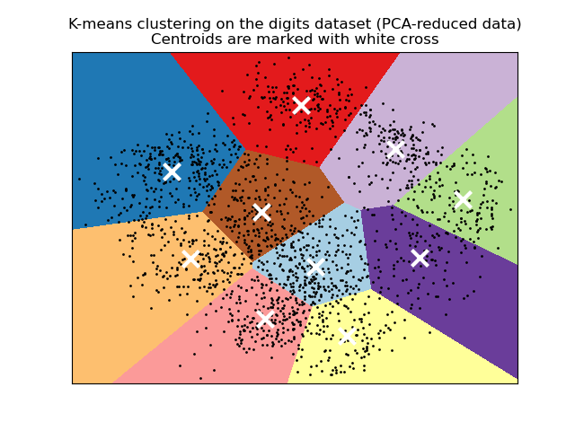  
*Source: scikit-learn webpage*  

First off, the algorithm is built with centroids calculated by the mean distances to all of the observations in their own area, and the observations (for example, points in a 2 dimension space), which are partitioned to the centroids base on their distances to them (belongs to centroid A if they are nearest to A compared to other centroids B, C, D). If you understand this concept, congratulation, you've just grasped the essence of the k-means clustering algorithm.  

This algorithm is for **unsupervised learning problems**. Usually, a **supervised** problem consists of a dataset having a certain amount of features as inputs, and a label vector which acts like a set of answers for the predictions originated from that dataset. In contrast, an **unsupervised** problem only provides a dataset with no attached or defined label vector; hence, in this problem, we need to group or partition the dataset into different clusters. This kind of problems can be seen regularly in real life in tasks requiring us to separate or group customers based on their spending, or items tiers based on their prices. To be more specific, a company can use this grouping method for this unsupervised problem to classify their customers into groups, and then prepare marketing plans, which would target each group with a different approach.
<!-- unsupervised -->
 
## 2. The main steps
To sum it up, our algorithm consists of the following things:  
**Input:** dataset *X* and number of clusters *K*  
**Output:** centroids *M* and label matrix *Y*
1. Initialize *K* clusters by choosing randomly *K* observations
2. Classify our observations into their nearest cluster, receive the label matrix *Y*
3. If the label matrix stays the same as it was in the last iteration, the algorithm will stop
4. Update the centroids by calculating the mean of their cluster observations
5. Back to step 2  
<!-- -->

## 3. Apply with Python
First of all, we'll need to import necessary libraries and set the random seed for our program.
```python
import numpy as np
import matplotlib.pyplot as plt
from scipy.spatial.distance import cdist

np.random.seed(20)
```
The *numpy* is used for working with arrays, specifically our dataset, *matplotlib* for plotting and **cdist** from the *scipy* library to calculate the Euclidean norm (distance). You can set the seed with different a number. Next, we'll create our own dataset:
```python
#create 2-D dataset
means = [[2, 2], [8, 3], [3, 6]]
cov = [[1, 0], [0, 1]]
N = 200
X0 = np.random.multivariate_normal(means[0], cov, N)
X1 = np.random.multivariate_normal(means[1], cov, N)
X2 = np.random.multivariate_normal(means[2], cov, N)

X = np.concatenate((X0, X1, X2), axis = 0) #number of observations
K = 3 #number of clusters

original_label = np.asarray([0]*N + [1]*N + [2]*N).T #true labels
```
We're going to play with a dataset with 3 clusters (you don't need to actually understand the process I'm using to create the dataset). If you read other articles about implementing the K-means algorithm with Python on other websites, you'll see they often use the **make_blobs** from *sklearn.datasets* to create the same type of data as the process I'm using. Now we'll try to plot the dataset with our defined labels to see the shape of it
```python
def kmeans_plot(data, labels):
    '''Plotting dataset'''

    K = max(labels) + 1
    fig, ax = plt.subplots()

    for i in range(K):
        x = data[labels == i, 0]
        y = data[labels == i, 1]

        ax.scatter(x, y, s=10, alpha=.8)
    ax.set_title(f'Dataset X with {data.shape[0]} observations and {K} clusters
```
```python
kmeans_plot(X, original_label)
```
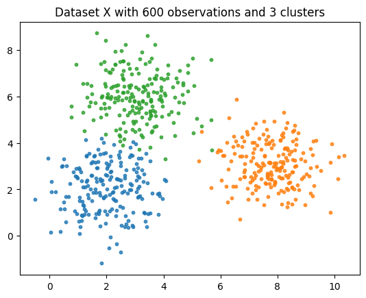  
Looks good! If you want more observations, more points on the plot, just increase `N`. Now, this looks perfect because we've defined the labels for our dataset, which won't happen in real life since we use K-means for datasets that don't have labels. Just imagine when you have no label, you now have to implement the algorithm to find your label vector. Remember the steps? Remember that we need at least 2 functions to *assign labels* and *update centroids* for step 2 and 4
```python
def assign_label(data, centroids):
    #calculate distance of each point to all centroids
    D = cdist(data, centroids)

    #get the nearest centroid
    labels = np.argmin(D, axis=1)

    return labels

def update_centroids(data, labels, centroid_id):
    #get all points within the cluster of centroid = centroid_id
    centroid_points = data[labels == centroid_id, :]

    #compute new centroid of that cluster
    new_centroid = np.mean(centroid_points, axis=0)

    return new_centroid
```
For step 2, assigning labels requires us to calculate the distance from each points to all the centroids, which is the use of *cdist*. After calculating the Euclidean distances, we construct a new label vector for each point using the *argmin* method. For example, suppose we have an ndarray `[0.5, 0.18, 0.932]`, the *min* value will be `0.18` but the *argmin* value will be `2`. With this technique, we are able to assgin the labels for their respective observations as their nearest centroids. Step 4 is straight-forward, since we're calculating the new centroid for a specific cluster. As you can see, this function only operates for a single cluster as we'll put it in a loop to calculate for all centroids with their respective **centroid_id** ```[0, 1, 2]```.  
After constructing these main functions, we'll put them together in our K-means function using for training. 
```python
def k_means(data, K, max_it_num=10):
    '''Execute the K-means algorithm'''

    def assign_label(data, centroids):
        #calculate distance of each point to all centroids
        D = cdist(data, centroids)

        #get the nearest centroid
        labels = np.argmin(D, axis=1)

        return labels

    def update_centroids(data, labels, centroid_id):
        #get all points within the cluster of centroid = centroid_id
        centroid_points = data[labels == centroid_id, :]

        #compute new centroid of that cluster
        new_centroid = np.mean(centroid_points, axis=0)

        return new_centroid

    #step 1
    centroids = data[np.random.choice(data.shape[0], K, replace=False)]

    #log labels of the dataset
    labels_hist = []
    it_count = 0

    for _ in range(max_it_num):
        #step 2
        label = assign_label(data, centroids)

        #step 3. Compare the newly calculated labels with the previous set
        if len(labels_hist) != 0 and (label == labels_hist[-1]).all():
            break
        
        #logging labels
        labels_hist.append(label)

        #step 4
        for centroid_id in range(K):
            centroids[centroid_id] = update_centroids(data, label, centroid_id)

        it_count += 1
    
    return (it_count, labels_hist[-1], centroids)
```
If you look closely, we now have step 1 in our function, which is initializing centroids for the first iteration. Initializing centroids are important (discussed later) in our traning process since it could affect the cost or even the output of our algorithm. There are multiple K-means initializing method but we'll deploy the simplest method: **random**. We use *random.choice* to random *K* indices of observations in our dataset. Next, a logging method for our label vector history is also required as we need to compare the newly calculated label vector with the latest one (step 2). Then, all the steps are put in a `for` loop to apply the algorithm again and again till we have our answers. As you can see, the code in the loop follows exactly the same as the steps I've covered, except now we need to log the label vector calculations.  
Let's run this bunch, shall we?
```python
(n, labels, centroids) = k_means(X, 3, 30)
print(f'Total iterations: {n}')
print(f'All centroids: {centroids}')
```
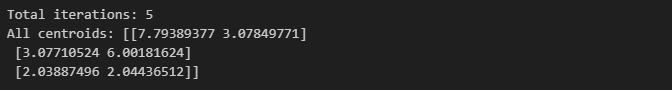  
Noice~~ We only need 5 loops to have our clusters, looks like K-means is quite nice. Let's plot it out
```python
kmeans_plot(X, labels)
```
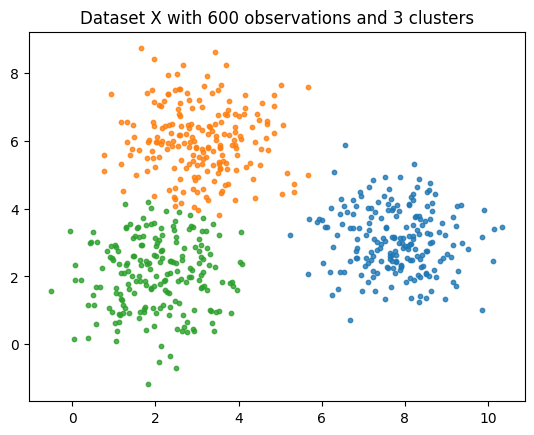  
Perfect! Since this blog is for learning and introduce you to K-means, I need to code the algorithm from scratch, but from now on you'll only need to apply the KMeans class from the famous [scikit-learn](https://scikit-learn.org/stable/index.html) library. Let's test it!
```python
from sklearn.cluster import KMeans

kmeans = KMeans(n_clusters=3, random_state=20, init='random').fit(X)
print(f'All centroids: {kmeans.cluster_centers_}')
```
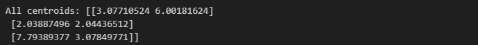
```python
kmeans_plot(X, kmeans.labels_)
```
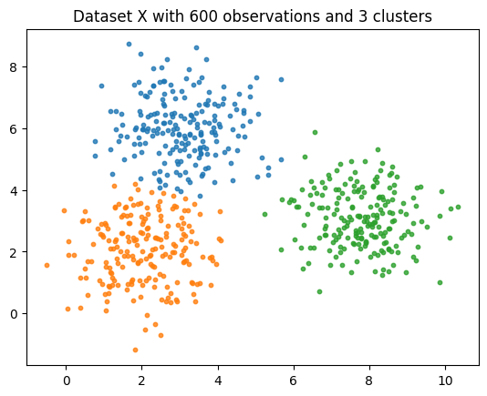  
Obviously, our centroids order is different from what we get using sklearn, but it doesn't matter, since the coordinates for the centroids are all the same! For more information about this class of sklearn, you can find their doc [here](https://scikit-learn.org/stable/modules/generated/sklearn.cluster.KMeans.html). GGEZ!

## 4. K choice strategies
If you've understood everything I've explained, then you should realize that the K means algorithm has one uncertain factor, that is defining the number of clusters *K*. There are several metrics and strategies for defining our suitable K for the dataset, but *trials and errors* is the most straight-forward and popular method. We'll iteratively choose K in a specified range (say, 10?). The algorithm will then complete its work for every K in that range, along with calculating the loss or measures based on the method we chose to apply to. There are several methods and metrics used for this tasks, however, let's start with some basic theoretical terms.

### Intra and Inter cluster distance
In this problem, there are 2 attributes we need to take into account during the progress of finding the best K and centroids. These are (1) the sum of squared distances from all samples inside a cluster to its corresponding centroid (called **Intra cluster distance**, or **inertia**), and (2) the distances between clusters (called **Inter cluster distance**). Although (2) has various ways to calculate the final figure, for now I refer to *Centroid Linkage Distance*, for more information, pleaser refer to [this doc](https://www.geeksforgeeks.org/ml-intercluster-and-intracluster-distance/).  

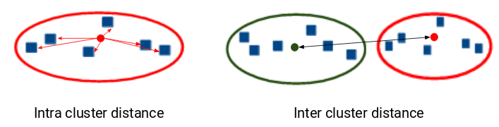 Source: Analytics Vidhya  

The algorithm has to find the best set of centroids that all have a certain density of samples and still stay separate, in other word, to stay far enough from other clusters. Therefore, our goal is to **minimize the inertia and maximize the Inter cluster distance**.

### The Elbow method
Arguably the most effective but simple method. This technique requires us to iteratively apply the K-means algorithm to a specified range of K (mentioned above). We'll then choose K where the **inertia** of our dataset drops significantly, with the fact that increasing K will bring only slight decreases to the dataset **inertia**. When we plot it out, the line graph would look like an elbow, and that pointy elbow is the best K (hopefully?).

For a quick demo with a more complex but simple enough dataset, I've implemented the K-means with the Iris dataset. The line graph for the inertia, or another fancy name is the **within-cluster sum of squares**, would look like this.

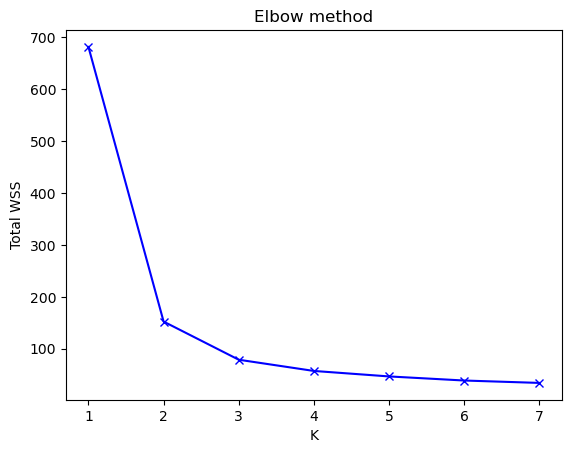

Do you see that pointy cutie patootie elbow? For best practice, many people choose the K next to that elbow, in this case, K = 3. The Iris dataset has 3 labels, corresponding to 3 types of Iris flower, but only 150 records are available. Therefore, choosing 2 or 3 for K would be a troublesome task if we don't know the right answer (which is the case in our chaotic real life). So, clearly we need another metrics to verify our answer.

### The Silhouette score and Davies-Bouldin Index
**The Silhouette score** can be presented below  
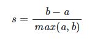  
where *b* is the mean nearest-cluster distance and *a* is the mean intra-cluster distance. The score is normalized to fluctuate in the range of `[-1, 1]`. The closer to 1 the better, while 0 indicates clusters overlap, and -1 means clusters are assigned falsely. The point for our Iris dataset is shown below.

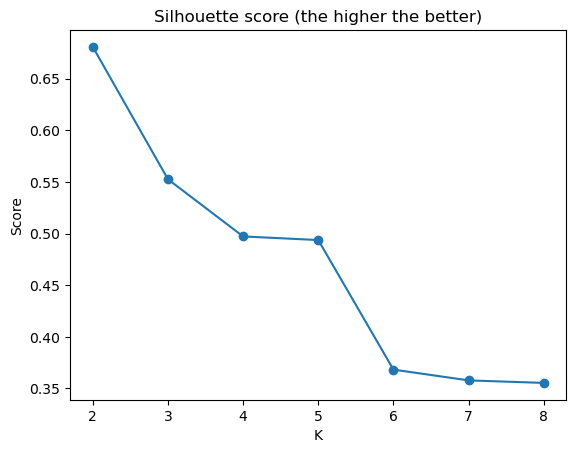

*Result*: K = 2

**The Davies-Bouldin Index** is a more complicated technique, which shows the 'similarity' between clusters, where the similarity is a measure that compares the distance between clusters with the size of the clusters themselves (cited from sklearn homepage). The closer to 0, the better result. The index point for our Iris dataset is shown below.

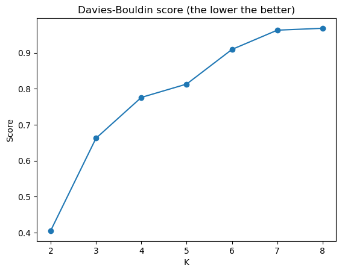

*Result*: K = 2

Now we got a problem, a real serious problem. As you can see here, after trying all 3 methods, we still get the same result indicates that K = 2 is the best number of clusters. This indicates that there should be only 2 kinds of Iris flower, although this is wrong. Through the evaluation progress, we are shown the weakness of this algorithm, that is the validity of clustering result depends greatly on our dataset, especially on aspects such as data distributions, dimensions and sufficiency.  

## 5. Downsides
Since K-means is a simple and fundamental algorithm, it has various critical weaknesses.
### Unavailability of cluster number
K-means need *K* clusters to be specified by the user to execute, which is not known by any ways. Therefore, you need to employ the algorithm through *trials and errors* manually using other evaluation metrics such as the techniques and metrics presented above.

### Greatly depends on clusters initialization process
In this blog, I used the primitive method of randomization to create centroids for the first run. This could result in fast learning models as the one below, which only took 5 iterations to complete.  
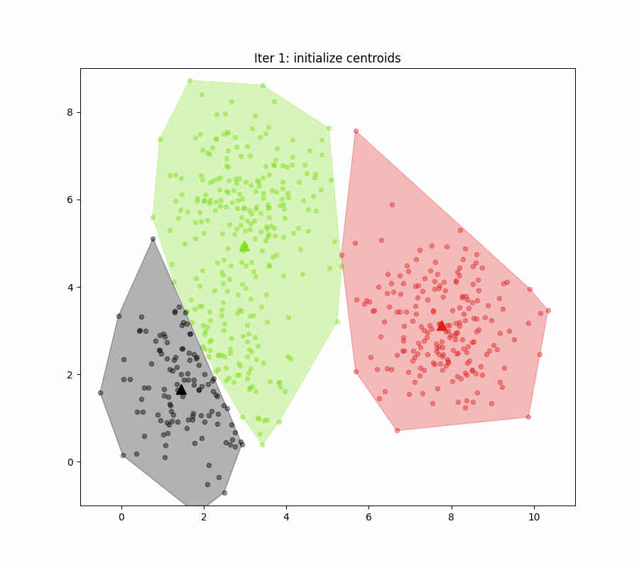

As you can see, this run commenced with a relatively good set of centroids which are evenly distributed to the 3 clusters. However, what will happen if we have initially 2 centroids placed near to each other in a small area, with the other one placed at the rest half of the plot?  
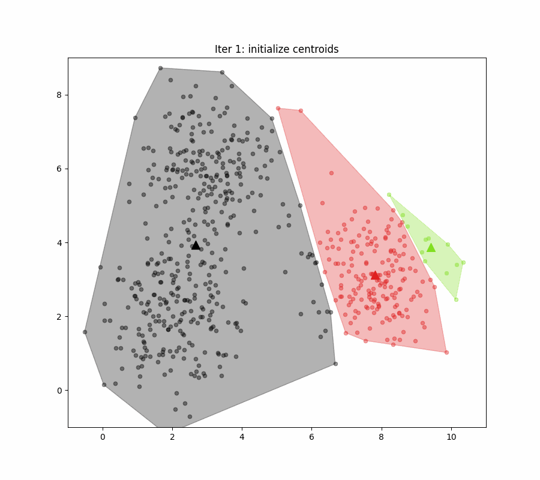

The algorithm took over 20 iterations to finish! That is bad, but stay tune, there is also a probability of randomization that even leads to incorrect results.  
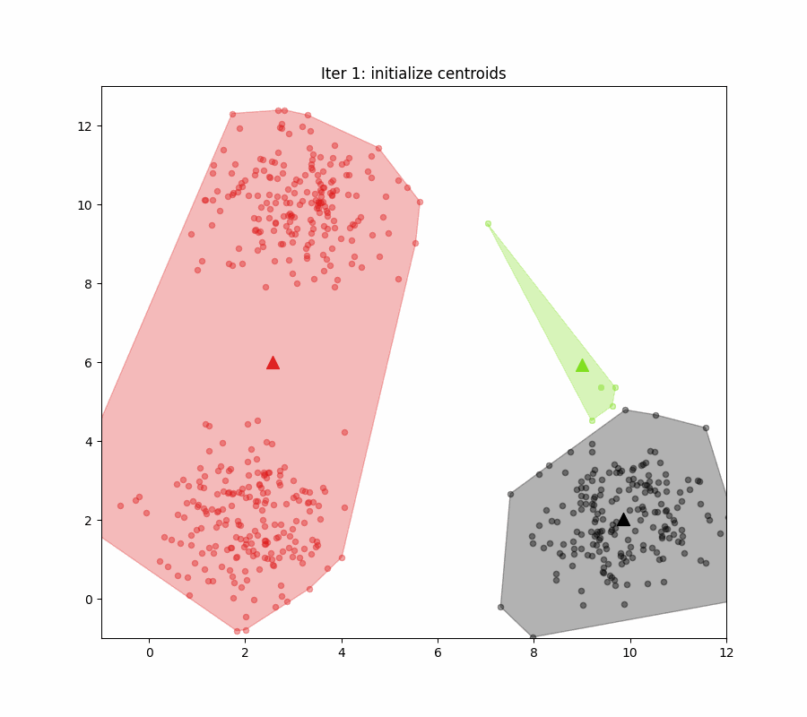

Random centroids initialization in our first iteration could affect substantially to the speed and clustering result of our algorithm. There is a proposed method used to initialize centroids without randomness, but with data distribution consideration. The method is quite advance and is beyond of the scope of this blog, please refer to [this paper](https://www.sciencedirect.com/science/article/abs/pii/S0167865504000996) for more information.

### Imperfect dataset structure
Datasets with uniformly or normally distributed observations are preferred. This infers datasets with even variance for all features (even variance just as having our covariance matrix `[[1,0],[0,1]]` which results in 2-D circle-shape data points) will work properly. Several defects or factors in the dataset that would potentially affect the algorithm are *clusters are not circles* (for 2-D observations), *outliers* or *uneven number of observations among clusters*.  

This incapability can be clearly presented for 2-D dataset, such as this run with a dataset having an uneven variance for all features. **A non-circle cluster** could lead to incorrect clustering.
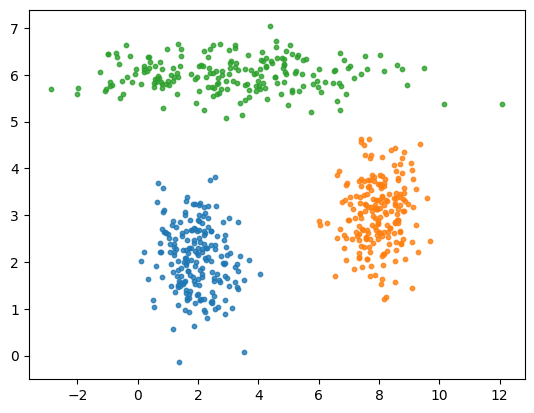

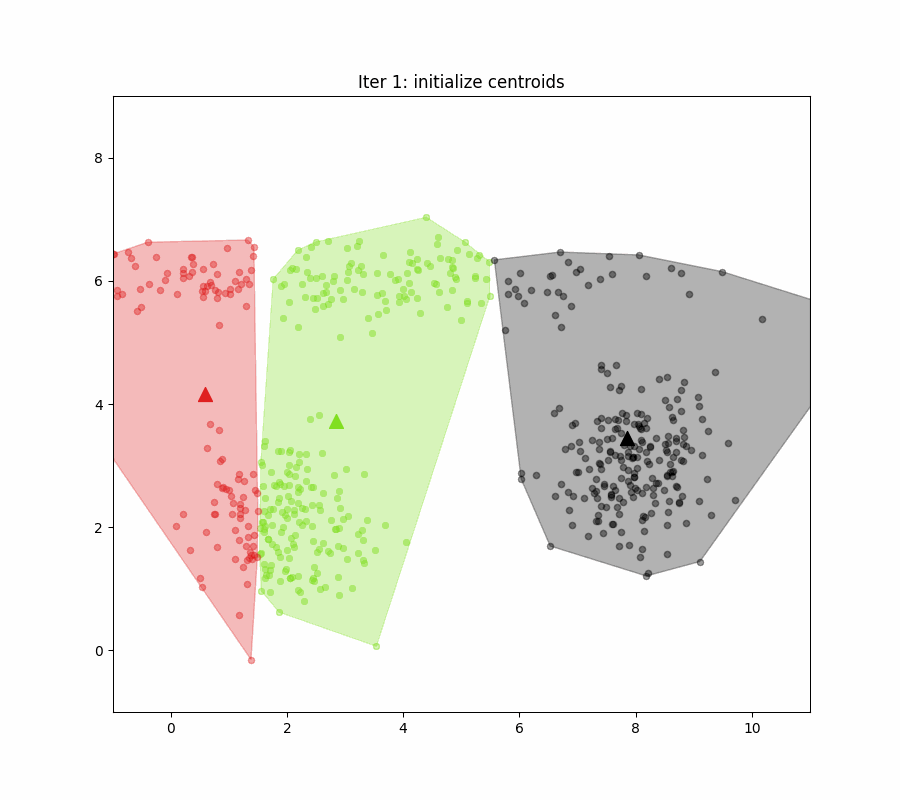

The same problem can happen to datasets having **uneven number of observations between clusters**.  
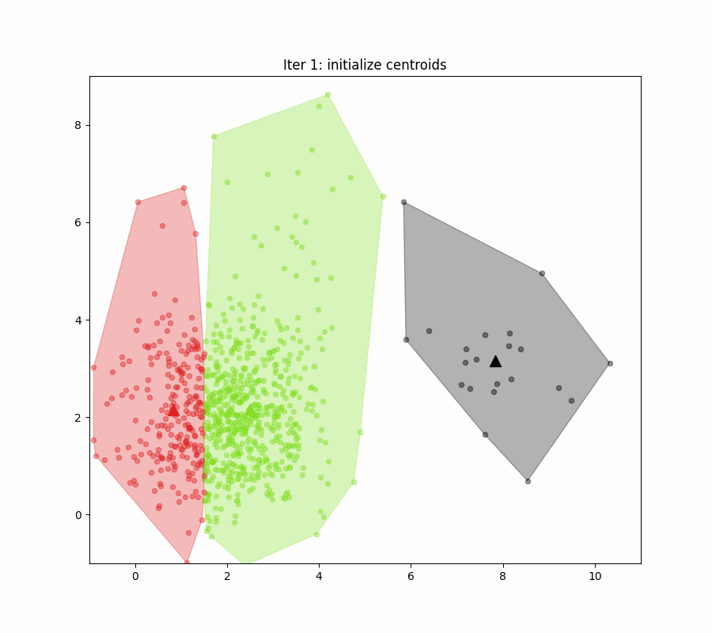
## 5. References
This blog is heavily inspired this [article](https://machinelearningcoban.com/2017/01/01/kmeans/). Most of the math I've introduced in the pdf file is taken from it (with some slight changes based on other sources and my understanding). I (probably) won't find any other detailed explanation like this article. More source,
- [Deep Ai Khanhblog](https://phamdinhkhanh.github.io/deepai-book/ch_ml/KMeans.html#su-hoi-tu-cua-thuat-toan-k-means-clustering): another detailed Vietnamese blog
- [Analyticsvidhya](https://www.analyticsvidhya.com/blog/2019/08/comprehensive-guide-k-means-clustering/): doesn't have math but provides evaluation metrics
- [towardsdatascience](https://towardsdatascience.com/k-means-clustering-algorithm-applications-evaluation-methods-and-drawbacks-aa03e644b48a): comprehensive but I haven't finished reading it yet